<div align="center">

  
  

  # 🚗 Gear Go Ecosystem
  **The Complete Flutter Car Rental Solution**

  [](https://flutter.dev)
  [](https://firebase.google.com)
  [](https://appwrite.io)
  [](https://dart.dev)

  <p>
    <a href="#-gear-go--customer-app">Customer App</a> •
    <a href="#-car-rental-admin--dashboard">Admin Panel</a> •
    <a href="#-tech-stack">Tech Stack</a> •
    <a href="#-installation">Installation</a>
  </p>
</div>

---

## 📖 Overview

**Gear Go** is a production-ready, dual-application system designed to digitize the car rental business. It consists of two synchronized mobile applications sharing a scalable cloud architecture.

| **📱 Customer App** | **🛠 Admin Panel** |
| :--- | :--- |
| A B2C application allowing users to browse, book, and track vehicle rentals with AI-driven recommendations. | A management suite for fleet owners to control inventory, validate bookings, and generate financial reports. |

---

## 📱 Gear Go – Customer App
> **"Your Journey Starts Here"**

Designed for a seamless user experience, the customer app handles everything from identity verification to vehicle return.

### ✨ Key Features
* 🔐 **Secure Auth:** Google & Email Sign-in via Firebase.
* 🧠 **AI Recommendations:** Suggests cars based on user history.
* 📍 **Smart Filters:** Filter by Brand, Type, Price, and Location.
* 📄 **Digital Contracts:** View rental agreements & PDF invoices.
* 🔔 **Live Updates:** Real-time push notifications for booking status.

### 📸 UI Showcase

<table align="center">
  <tr>
    <td align="center"><b>Splash & Onboarding</b></td>
    <td align="center"><b>Home & Search</b></td>
    <td align="center"><b>AI Recommendations</b></td>
  </tr>
  <tr>
    <td></td>
    <td>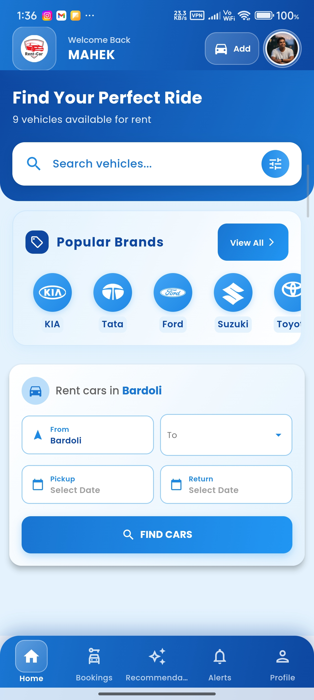</td>
    <td>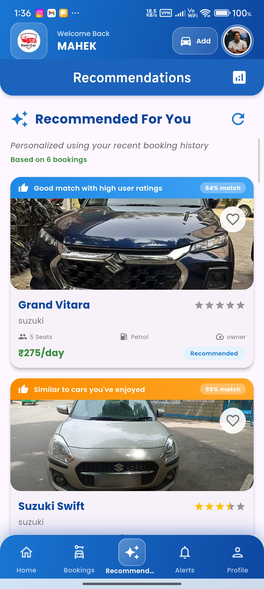</td>
  </tr>
  <tr>
    <td align="center"><b>Booking Status</b></td>
    <td align="center"><b>Vehicle Details</b></td>
    <td align="center"><b>Profile & Settings</b></td>
  </tr>
  <tr>
    <td>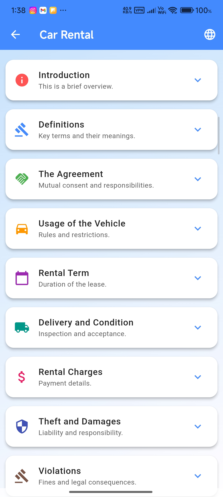</td>
    <td></td>
    <td></td>
  </tr>
</table>

<details>
<summary><b>🔻 Click to see more Customer Screens</b></summary>
<br>
<table align="center">
  <tr>
    <td>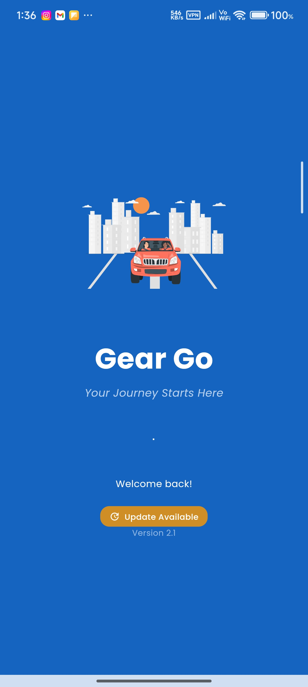</td>
    <td></td>
    <td>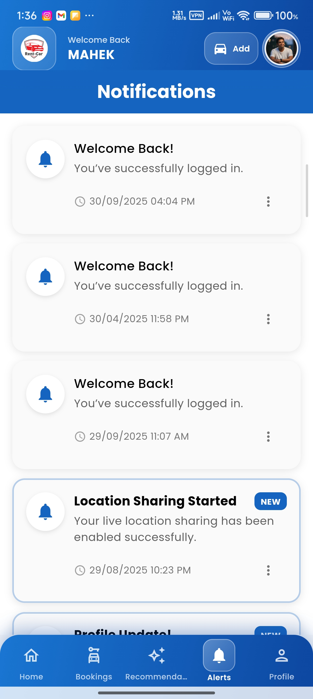</td>
  </tr>
  <tr>
    <td></td>
    <td>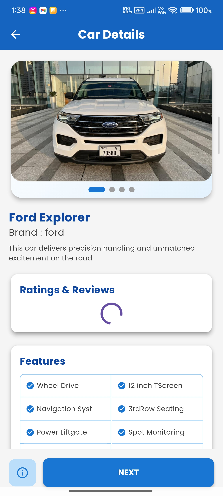</td>
    <td>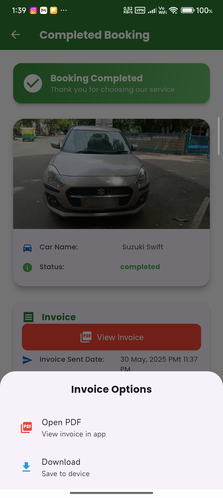</td>
  </tr>
</table>
</details>

---

## 🛠 Car Rental Admin – Dashboard
> **"Complete Fleet Control"**

The command center for business owners. Manage your fleet, approve requests, and handle operational issues instantly.

### ✨ Key Features
* 📊 **Dashboard Analytics:** Quick view of active, pending, and completed rides.
* 🚘 **Inventory Management:** Add/Edit cars with Appwrite image hosting.
* 💬 **WhatsApp Integration:** Automated alerts sent to Admin WhatsApp on new bookings.
* 📑 **Invoicing:** Generate professional PDF invoices.
* ⚠️ **Damage Control:** Review user-submitted damage reports with photos.

### 📸 UI Showcase

<table align="center">
  <tr>
    <td align="center"><b>Admin Dashboard</b></td>
    <td align="center"><b>Booking Management</b></td>
    <td align="center"><b>Add New Vehicle</b></td>
  </tr>
  <tr>
    <td></td>
    <td>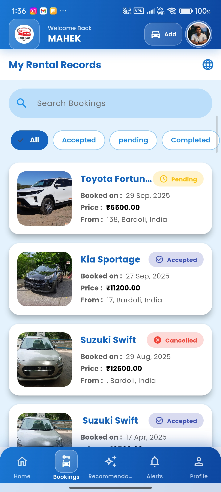</td>
    <td>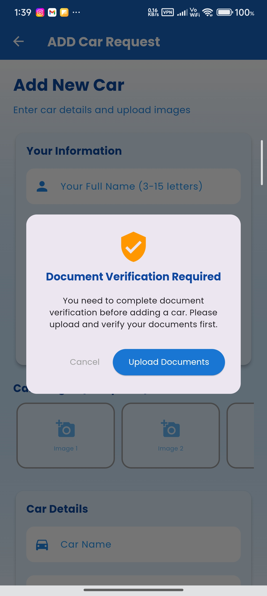</td>
  </tr>
  <tr>
    <td align="center"><b>Damage Reports</b></td>
    <td align="center"><b>WhatsApp Alerts</b></td>
    <td align="center"><b>PDF Invoices</b></td>
  </tr>
  <tr>
    <td></td>
    <td>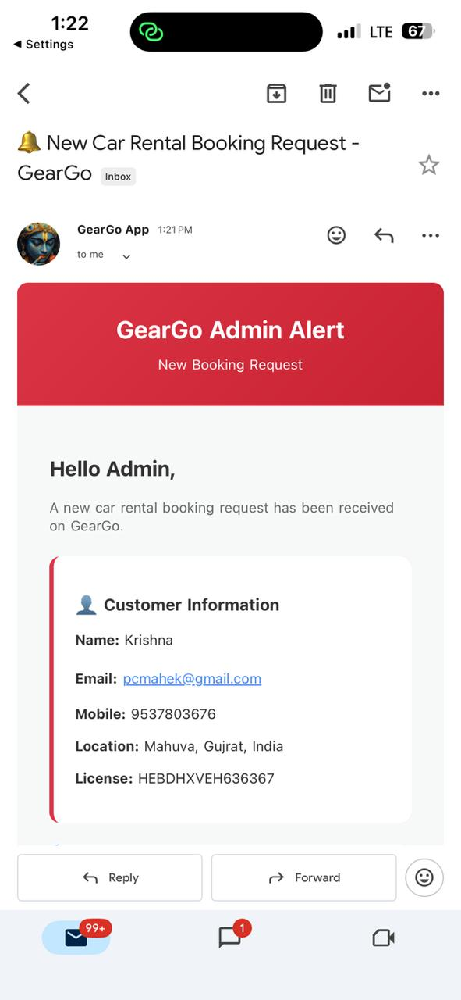</td>
    <td>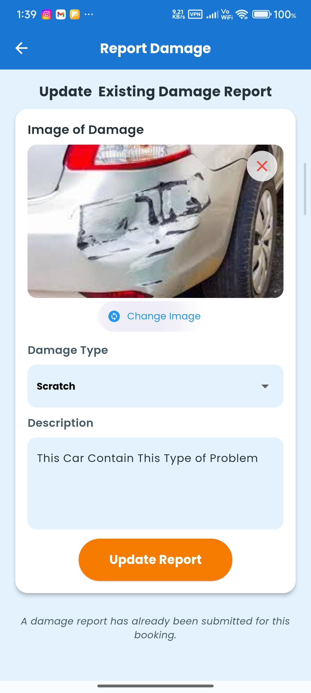</td>
  </tr>
</table>

---

## 🏗 Tech Stack

The project relies on a **Hybrid Cloud Architecture** to optimize for speed and storage costs.

| Component | Technology | Purpose |
| :--- | :--- | :--- |
| **Frontend** | Flutter (Dart) | Cross-platform mobile UI |
| **Database** | Cloud Firestore | Real-time NoSQL database |
| **Storage** | Appwrite Storage | High-performance image hosting |
| **Auth** | Firebase Auth | Secure user identity management |
| **Notifications** | FCM | Push notifications for status updates |
| **External API** | WhatsApp API | Urgent admin alerts |

---

## 🚀 Installation

Follow these steps to set up the ecosystem locally.

### Prerequisites
* Flutter SDK installed
* Firebase Project created
* Appwrite Server running (or Cloud)

### 1. Clone the Repository
```bash
git clone [https://github.com/yourusername/gear-go-ecosystem.git](https://github.com/yourusername/gear-go-ecosystem.git)