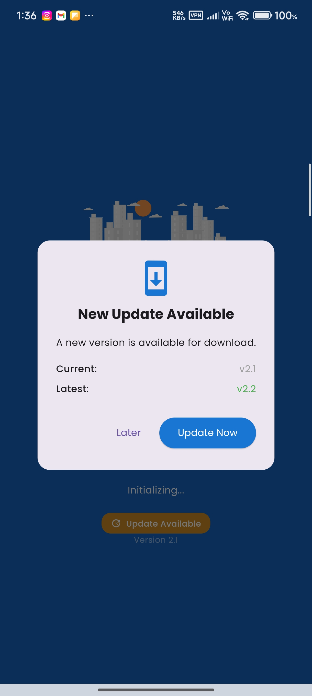
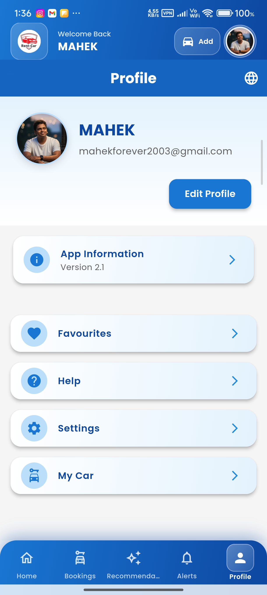
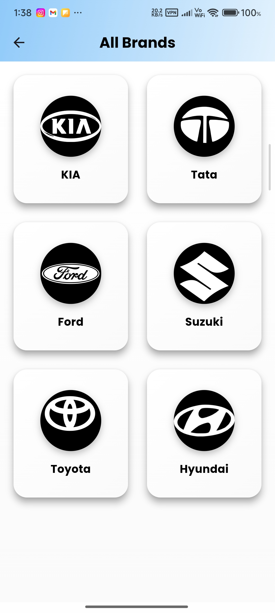
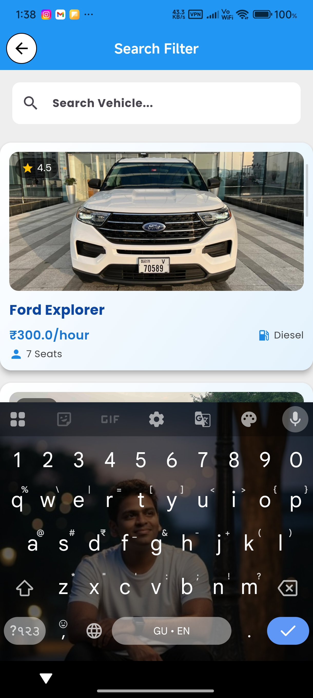
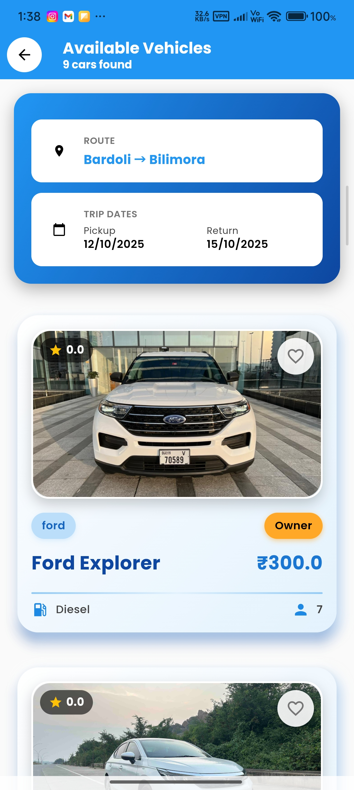
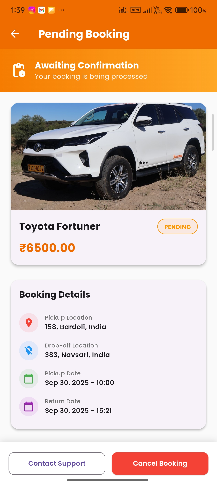
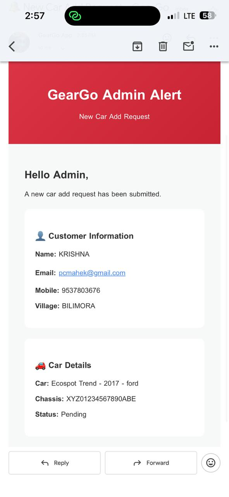
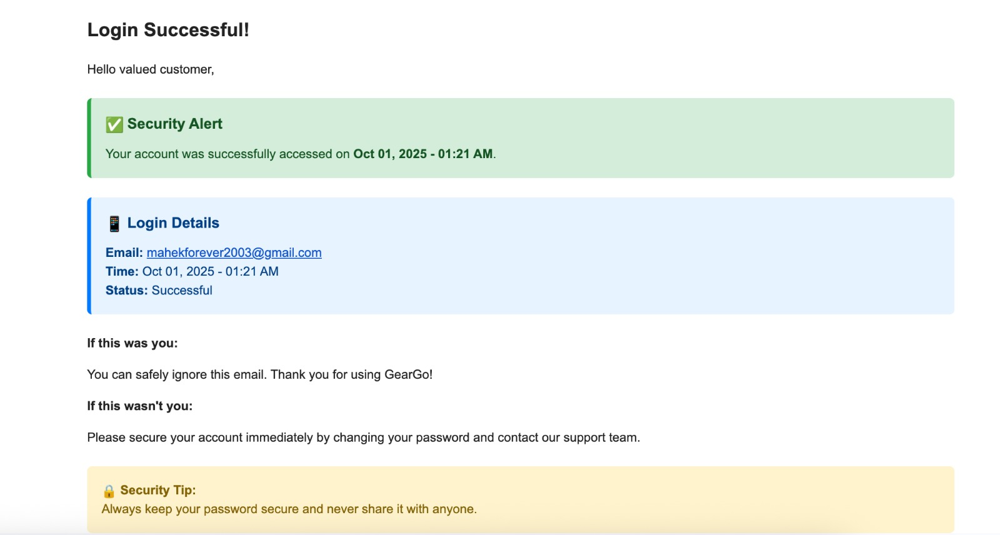

# 🚗 Car Rental Flutter Applications

This repository contains two Flutter applications for a complete car rental system.

---

  
  
  
  

---
## 📱 Gear Go – Customer Application

  

  <b>Your Journey Starts Here</b>

---

## 📖 Overview

**Gear Go** is a customer-facing car rental mobile application built using **Flutter**.  
Users can browse vehicles, make bookings, manage rentals, receive notifications, and view invoices.

The app uses a **scalable cloud architecture** where data and images are handled separately.

---

## 🛠 Tech Stack

- Flutter
- Firebase Authentication
- Cloud Firestore
- Appwrite Storage (for images)
- Firebase Cloud Messaging (FCM)

---

## 🔄 Data Architecture

- **Images**
  - Stored in **Appwrite Storage**
  - Image URLs saved in **Firestore**

- **Data**
  - Users, cars, bookings, notifications stored in **Cloud Firestore**
  - Real-time updates

---

## ✨ Key Features (Customer Side)

- Secure login & authentication
- Browse cars by brand & location
- Search & filter vehicles
- Car booking & rental management
- AI-based recommendations
- Notification center
- Profile management

---

## 📸 App Screenshots

### 🚀 Core Screens

| | | |
|---|---|---|
|  |  |  |
| Splash & Update | Welcome | Home |

| | | |
|---|---|---|
|  |  |  |
| My Bookings | AI Recommendations | Notifications |

| | | |
|---|---|---|
|  |  |  |
| Profile | About | Brands |

---

### 🔍 Advanced Screens

| | | |
|---|---|---|
|  |  |  |
| Filters | Car Card | Gallery |

| | | |
|---|---|---|
|  |  |  |
| Agreement | Pending | Payment |

| | | |
|---|---|---|
|  |  |  |
| Completed | Invoice | Damage |

---

## 🛠️ Car Rental Admin – Admin Application

  

  <b>Manage Cars, Bookings & Customers</b>

---

## 📖 Admin App Overview

The **Car Rental Admin App** is designed for administrators and car owners to manage the entire rental system efficiently.  
It provides full control over cars, bookings, users, payments, and system notifications.

The admin app works in sync with the customer app using **Cloud Firestore** and **Appwrite Storage**.

---

## 🛠 Admin Tech Stack

- Flutter
- Firebase Authentication
- Cloud Firestore
- Appwrite Storage (for images)
- Firebase Cloud Messaging
- WhatsApp Alerts (Admin notifications)

---

## ✨ Admin Features

- Admin authentication & role-based access
- Add, update & remove cars
- Manage brands & vehicle listings
- View & approve bookings
- Booking status management (Pending / Completed)
- Invoice generation & download
- Damage report handling
- WhatsApp & email alerts
- Real-time dashboard updates

---

## 📸 Admin App Screenshots

### 🚀 Core Admin Screens

| | | |
|---|---|---|
|  |  |  |
| Splash & Update | Admin Login | Dashboard |

| | | |
|---|---|---|
|  |  |  |
| Booking List | Smart Insights | Notifications |

| | | |
|---|---|---|
|  |  |  |
| Admin Profile | About System | All Brands |

---

### 🔍 Admin Management Screens

| | | |
|---|---|---|
|  |  |  |
| Advanced Filters | Car Card | Car Gallery |

| | | |
|---|---|---|
|  |  |  |
| Rental Agreement | Pending Booking | Payment Pending |

| | | |
|---|---|---|
|  |  |  |
| Completed Booking | Invoice Options | Damage Report |

---

### 📄 Reports & Alerts

| | | |
|---|---|---|
|  |  |  |
| Invoice PDF | Add New Car | WhatsApp Alert |

| | | |
|---|---|---|
|  |  |  |
| Car Added Alert | Security Email |  |

---

## 👨‍💻 Author

**Mahek**  
Flutter Developer | Firebase | Appwrite
