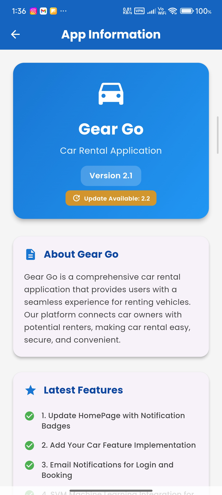
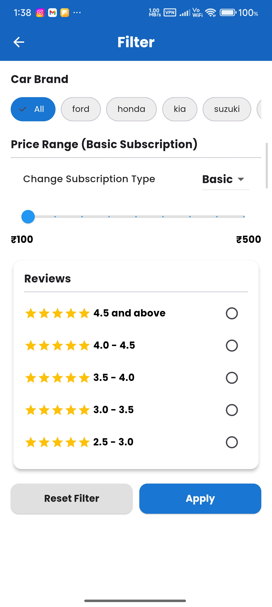
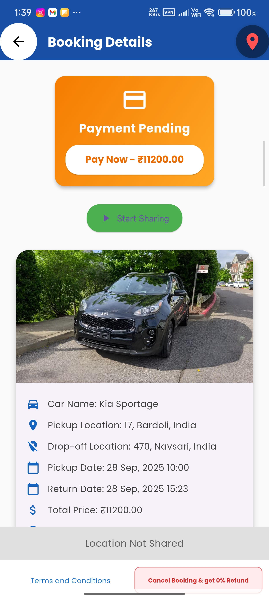
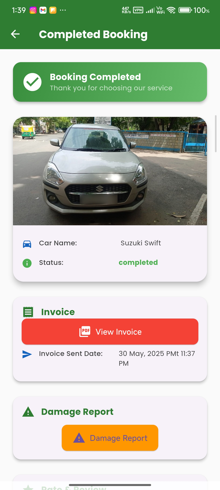

# 🚗 Car Rental Flutter Applications

This repository contains two Flutter applications for a complete car rental system.

---

## 📱 Gear Go – Customer Application

  

  <b>Your Journey Starts Here</b>

---

## 📖 Overview

**Gear Go** is a customer-facing car rental mobile application built using **Flutter**.  
Users can browse vehicles, make bookings, manage rentals, receive notifications, and view invoices.

The app uses a **scalable cloud architecture** where data and images are handled separately.

---

## 🛠 Tech Stack

- Flutter
- Firebase Authentication
- Cloud Firestore
- Appwrite Storage (for images)
- Firebase Cloud Messaging (FCM)

---

## 🔄 Data Architecture

- **Images**
  - Stored in **Appwrite Storage**
  - Image URLs saved in **Firestore**

- **Data**
  - Users, cars, bookings, notifications stored in **Cloud Firestore**
  - Real-time updates

---

## ✨ Key Features (Customer Side)

- Secure login & authentication
- Browse cars by brand & location
- Search & filter vehicles
- Car booking & rental management
- AI-based recommendations
- Notification center
- Profile management

---

## 📸 App Screenshots

### 🚀 Core Screens

| | | |
|---|---|---|
|  |  |  |
| Splash & Update | Welcome | Home |

| | | |
|---|---|---|
|  |  |  |
| My Bookings | AI Recommendations | Notifications |

| | | |
|---|---|---|
|  |  |  |
| Profile | About | Brands |

---

### 🔍 Advanced Screens

| | | |
|---|---|---|
|  |  |  |
| Filters | Car Card | Gallery |

| | | |
|---|---|---|
|  |  |  |
| Agreement | Pending | Payment |

| | | |
|---|---|---|
|  |  |  |
| Completed | Invoice | Damage |

---

## 👨‍💻 Author

**Mahek**  
Flutter Developer | Firebase | Appwrite
